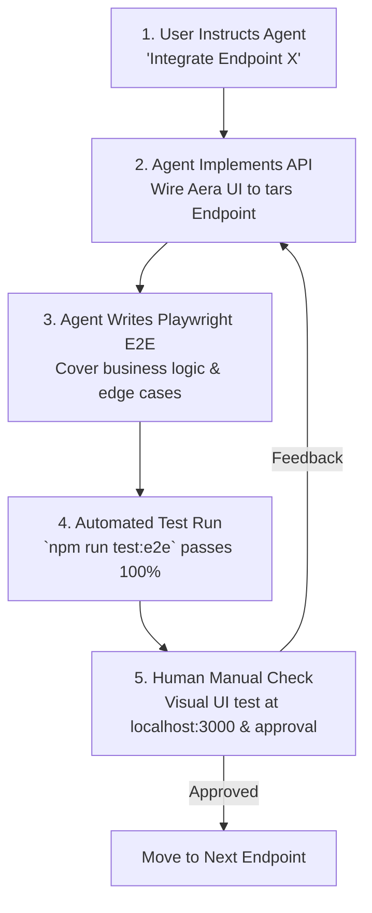

# Master Agentic API Integration & E2E Testing Plan

**Project**: Framehouse Platform (`Aera` Frontend + `tars` Backend)  
**Author**: Lead Full-Stack Architect & AI Pair Programmer  
**Status**: Active Execution Roadmap  

---

## 1. Evaluation of Your Agentic Workflow Plan

> [!TIP]
> **Verdict: Your plan is EXCELLENT.**  
> An iterative, endpoint-by-endpoint, human-in-the-loop workflow is the gold standard for agentic software engineering.

### Why Your Plan Works:
1. **Scope Control**: Working on one API endpoint domain at a time prevents scope creep and keeps context tight.
2. **Double Verification (Automated + Human)**:
   - **Agent**: Integrates API in React UI + Writes Playwright E2E test specs to validate business logic automatically.
   - **Human (You)**: Manually inspects the UI in browser at `http://localhost:3000` to verify visual aesthetics, animations, and UX feel.
3. **Regression Safety**: Every endpoint integrated gets locked in with Playwright E2E test specs, guaranteeing future endpoint integrations never break past features.

## 2. Mandatory Integration & Robustness Rules

> [!IMPORTANT]
> **Core Rule**: Always complete every API request-response cycle with proper error handling. Every network call must explicitly check HTTP response status, parse server error messages, handle network exceptions, and render actionable user-facing feedback without silent failures or unhandled promises.

> [!TIP]
> **Payload & Schema Discovery Rule**: Always read the backend route handlers and tests in `tars` (`tars/src/routes/*` and `tars/tests/*`) while integrating endpoints. Reading the `tars` tests and code gives the exact structure of request payloads to send from the frontend and response data DTOs to parse.

> [!CAUTION]
> **Git Operations Rule**: NEVER execute `git add`, `git commit`, or `git push` without explicit, direct instructions from the user. Leave all code edits unstaged in the working tree for user review.

## 3. The 5-Step Agentic Integration Loop

For every endpoint domain you assign:

### Step Breakdown:
1. **Assignment**: You prompt: *"Let me integrate the [Endpoint Name] endpoint next."*
2. **API Wiring**: Agent updates `Aera` frontend components/context to invoke `apiFetch('/path')`.
3. **E2E Spec Creation**: Agent creates/updates Playwright E2E test specs in `Aera/e2e/`.
4. **Automated Validation**: Agent runs `npm run test:e2e` to verify all test assertions pass.
5. **Human Inspection**: You open `http://localhost:3000` in browser, test manually, and approve!

---

## 3. Master Endpoint Integration Roadmap & Status Matrix

| Module | Endpoint Path | Method | Aera Target Page / Component | Status | E2E Covered |
| :--- | :--- | :---: | :--- | :---: | :---: |
| **0. Health** | `/health_check` | `GET` | System Health Monitoring | `[x] Done` | ✅ Yes |
| **1. Auth** | `/auth/register` | `POST` | `ArtistSetupPage.tsx` (`/profile/new`) | `[x] Done` | ✅ Yes |
| **1. Auth** | `/auth/login` | `POST` | `LoginPage.tsx` (`/profile/login`) | `[x] Done` | ✅ Yes |
| **1. Auth** | `/auth/logout` | `POST` | Profile Header / Studio | `[x] Done` | ✅ Yes |
| **1. Auth** | `/auth/reset-password` | `POST` | `ProfileEditPage.tsx` | `[ ] Pending` | ⏳ Pending |
| **2. Profiles**| `/profiles/me` | `GET` | `AuthContext.tsx` / Studio | `[x] Done` | ✅ Yes |
| **2. Profiles**| `/profiles/get_profile_details/:user_name` | `GET` | `ProfilePage.tsx` (`/profile/:user_name`) | `[x] Done` | ✅ Yes |
| **2. Profiles**| `/profiles/:artist_id/works` | `GET` | `ProfilePage.tsx` (Theatre Tab) | `[x] Done` | ✅ Yes |
| **2. Profiles**| `/profiles/:artist_id/wall` | `GET` | `ProfilePage.tsx` (Wall Tab) | `[x] Done` | ✅ Yes |
| **2. Profiles**| `/artists/update_stage` | `POST` | `StudioPage.tsx` (`/studio`) | `[x] Done` | ✅ Yes |
| **2. Profiles**| `/artists/favorite_artist` | `POST` | `ProfileHero.tsx` / `ProfilePage.tsx` | `[x] Done` | ✅ Yes |
| **2. Profiles**| `/artists/unfavorite_artist` | `POST` | `ProfileHero.tsx` / `ProfilePage.tsx` | `[x] Done` | ✅ Yes |
| **3. Originals**| `/originals/new` | `POST` | `OriginalCreatePage.tsx` (`/admin/originals/new`)| `[ ] Pending` | ⏳ Pending |
| **3. Originals**| `/originals/:id` | `GET` | `OriginalPage.tsx` (`/originals/:id`) | `[ ] Pending` | ⏳ Pending |
| **3. Originals**| `/originals` | `GET` | `OriginalsListPage.tsx` (`/originals`) | `[ ] Pending` | ⏳ Pending |
| **4. Works** | `/works/new/:type` | `POST` | `UploadPage.tsx` (`/works/new`) | `[ ] Pending` | ⏳ Pending |
| **4. Works** | `/works/:id` | `GET` | `WorkPage.tsx` (`/works/:id`) | `[ ] Pending` | ⏳ Pending |
| **5. Sets** | `/sets/new` | `POST` | `SetsPage.tsx` (`/sets/new`) | `[ ] Pending` | ⏳ Pending |
| **5. Sets** | `/sets/:id` | `GET` | `SetDetailPage.tsx` (`/sets/:id`) | `[ ] Pending` | ⏳ Pending |
| **5. Sets** | `/sets/discussion` | `POST` | `DiscussionPage.tsx` | `[ ] Pending` | ⏳ Pending |
| **6. Festivals**| `/festivals/:id` | `GET` | `FestivalDetailPage.tsx` (`/festivals/:id`) | `[ ] Pending` | ⏳ Pending |
| **7. Reactions**| `/artists/add_reaction`| `POST` | Work / Original Card Reactions | `[ ] Pending` | ⏳ Pending |
| **8. Admin** | `/admin/login` | `POST` | `AdminPage.tsx` (`/admin`) | `[ ] Pending` | ⏳ Pending |

---

## 4. Playwright E2E Spec Creation Rules for Agent

Every endpoint integration MUST include Playwright E2E test specs following these rules:
1. **Happy Path**: Test successful request and UI response (e.g. form submission $\rightarrow$ success state / redirect).
2. **Validation / Error Cases**: Test 400 Bad Request, 401 Unauthorized, or 409 Conflict handling.
3. **Database Assertion**: Ensure the backend writes to PostgreSQL and reads back correctly.
4. **UI Visual Integrity**: Ensure loading spinners hide and error banners display properly.

---

## 5. How We Will Execute (Next Steps)

You tell me which endpoint module to integrate next (e.g. *"Let's do Module 3: Originals endpoints next"*). 

I will:
1. Implement the API calls in `Aera`.
2. Write the corresponding Playwright E2E tests in `Aera/e2e/`.
3. Run automated tests and report exact output.
4. Prompt you to perform your manual UI check at `http://localhost:3000`!
